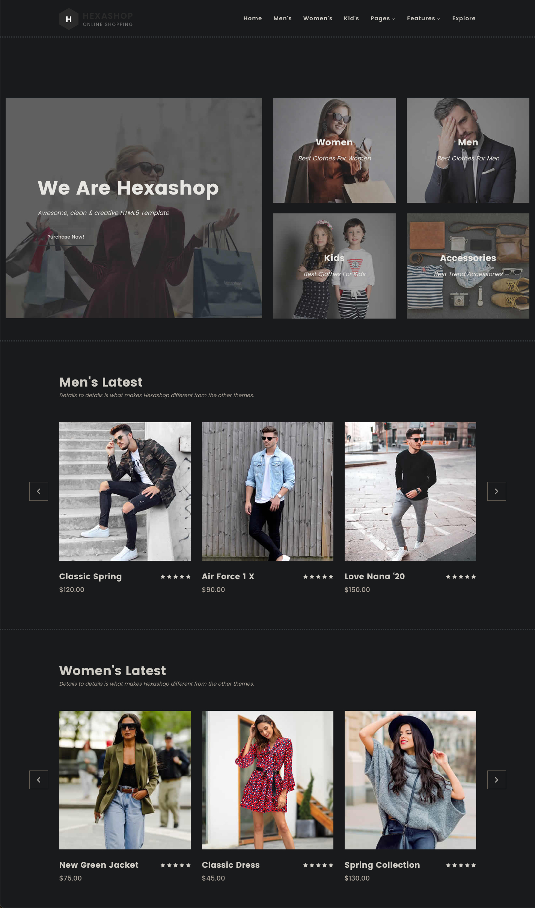
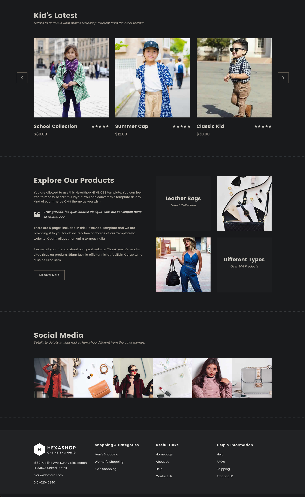
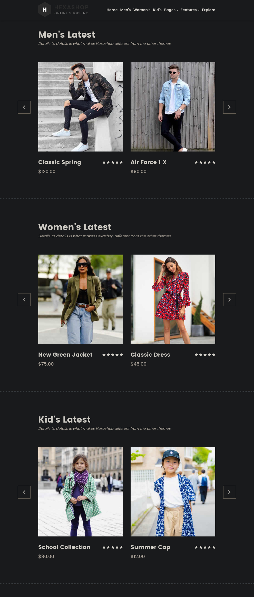
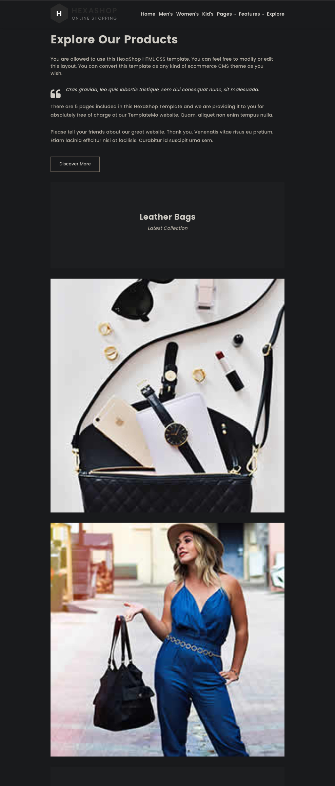
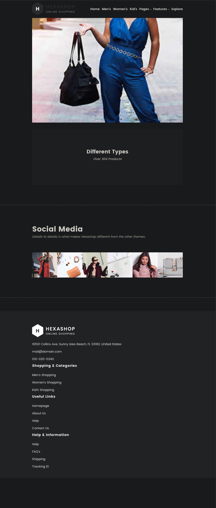
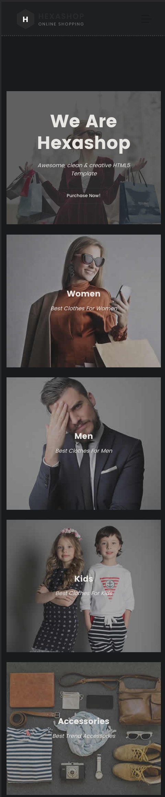
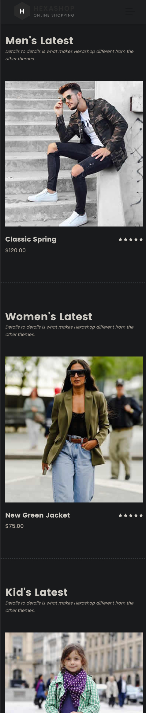
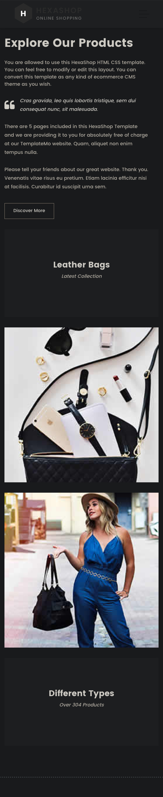
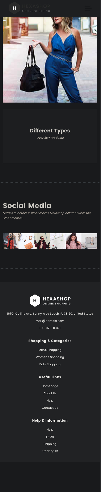

# The final homework

## Description

Let's put everything together and create a simple web application, that is both good looking and responsive. The template is a simple web shop for clothing.

## Goal

Main goal of this homework is to practice and learn more about responsive design and CSS, by combining everything we learned so far.

## Requirements
1. Use Grid, Flexbox or both to create the layout. 
2. Use media queries to make the page responsive. Have at least 3 different layouts for different screen sizes. You are free to use either mobile-first or desktop-first approach.

## Common questions
1. Does the page need to look 100% like the pictures? - No, you can change the colors, fonts, images, etc. as you wish. The important part is to have the same layout and responsiveness. 
2. Do I need to use the same images? - No, you can use any images you want. You can even use placeholders like [Lorem Picsum](https://picsum.photos/) or [Place Kitten](https://placekitten.com/). You can even remove the background images if you want, and limit the content to basic text and colors.
3. Do I need to use the same fonts? - No, you can use any fonts you want. You can even use the default fonts, like Arial, Times New Roman, etc.
4. Do I need to use the same colors? - No, you can use any colors you want.
5. Do I need to use the same icons? - No, you can use any icons you want or no icons at all.
6. Do I need to use the same text? - No, you can use any text you want. You can even use Lorem Ipsum or change the theme of the page to something else, like a web shop for electronics, etc.
7. Do I need to use the same logo? - No, you can use any logo you want or no logo at all.
8. Can this be archived with our current knowledge? - Yes, you can use everything we learned so far. You can use CSS Grid, Flexbox, media queries, etc.
9. Can I use Bootstrap? - No, you can't use Bootstrap or any other CSS library, use pure CSS.

## Main layout

## Tablet layout

## Mobile layout

