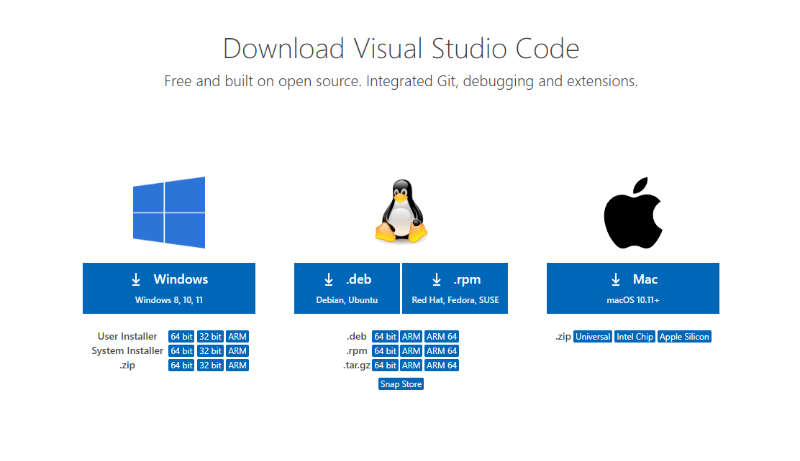
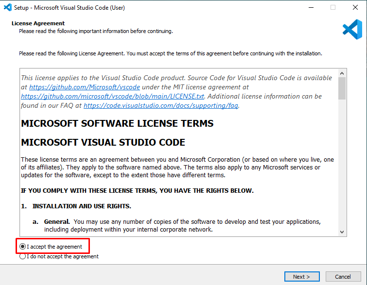
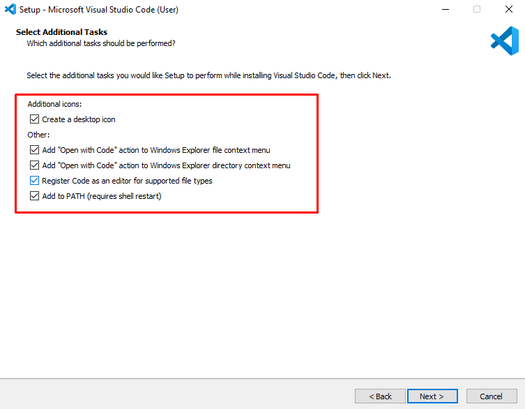
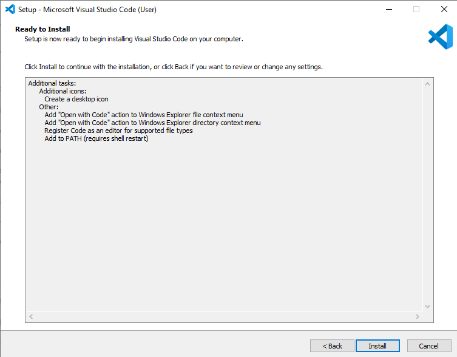
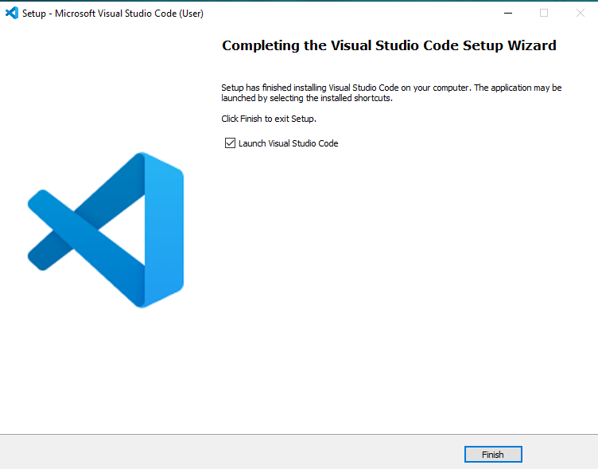

# How to install Visual Studio Code 2022 📜 
 

### 1. Download VS Code 2022 accordingly to your PC configurations and Operating System

** The following example is for Windows OS **

 

[Visual Studio Code (download link)](https://code.visualstudio.com/download#)

 

 

### 2. Open the downloaded installation setup and follow the steps bellow
 

 

### 3. Select all the checkboxes (preferably)
 

 

### 4. Click install and wait for the program to install
 

 

### 5. Finish the installation process
 

 

### 6. Open Visual Studio Code
 

 

<h2 align="center" style="font-size:80px;">
   🎉🎊 HAPPY CODING 🍻🥂
</h2>